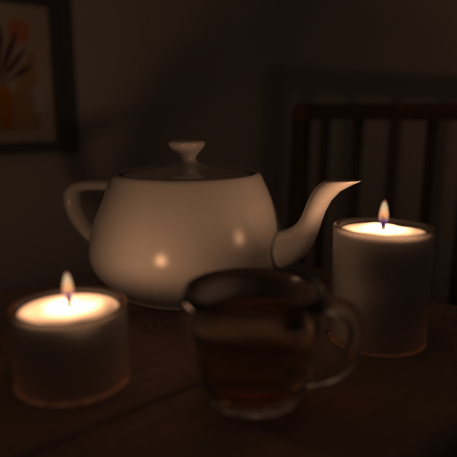
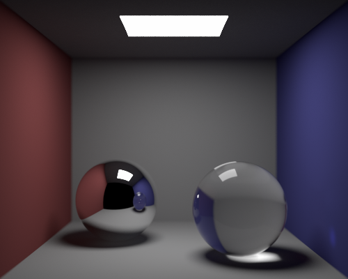
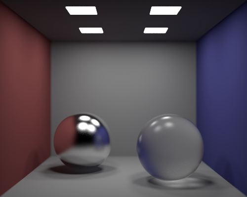
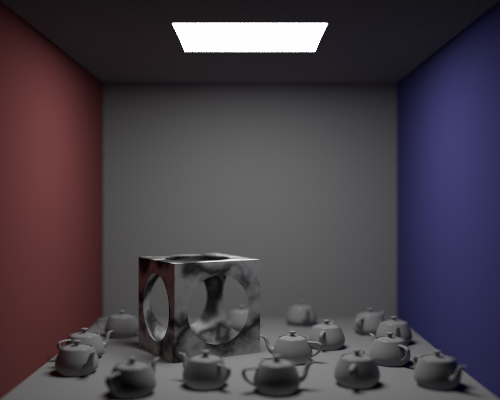
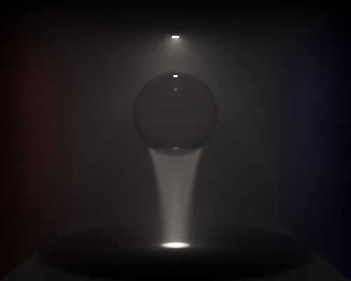

# Rust Ray Tracer

Fully-featured CPU ray tracer written in Rust, using Photon Mapping and Monte Carlo ray tracing techniques to generate photorealistic images.




## Table of Contents

- [Key Features](#key-features)
- [Gallery](#gallery)
- [Installation and Usage](#installation-and-usage)
- [YAML Scene Reference Guide](#yaml-scene-reference-guide)
- [Technical Details](#technical-details)
- [License](#license)

## Key Features

- **Global Illumination**: Implements advanced Photon Mapping (using dedicated global, caustic, and volumetric maps) for accurate indirect light transport and caustics.
- **Monte Carlo Techniques**: Uses Monte Carlo integration for accurate radiance estimates from the global photon map and to simulate glossy reflection and refraction.
- **Parallelised Operations**: Utilises the `rayon` crate to distribute ray tracing across all available CPU cores, maximising multi-threading performance.
- **KD-Tree Acceleration**: Custom KD-tree implementation optimises intersection testing for complex polygon meshes, using the Surface Area Heuristic (SAH) for highly efficient construction.
- **Advanced Geometry**: Supports a wide range of geometric primitives alongside Wavefront `.obj` meshes, Constructive Solid Geometry (CSG), and object instancing.
- **Physically Based Camera**: Features a thin-lens camera model to simulate realistic depth of field effects.
- **Live Rendering Preview**: Includes a thread-safe graphical user interface to monitor progressive rendering and sample accumulation.
- **YAML Scene Definition**: Streamlined scene design via a robust, custom YAML format.

## Gallery

Below are examples of scenes rendered using this ray tracer. The corresponding YAML configuration files are included in the repository in [`./scenes`](./scenes/), and can be viewed directly by clicking on an image.

---

[](scenes/spheres.yaml)

> *Simple scene demonstrating global illumination and caustics.*

--- 

[](scenes/multiple-lights-glossy.yaml)

> *Scene with multiple light sources and glossy reflection/refraction rendered using Monte Carlo integration.*

--- 

[](scenes/textures-and-models.yaml)

> *Example usage of an image texture and a Wavefront `.obj` mesh, alongside a pronounced depth-of-field effect achieved using a thin lens approximation.*

--- 

[](scenes/csg-instancing.yaml)

> *Highlights Constructive Solid Geometry (a sphere subtracted from a cube) using a procedural marble texture, alongside memory-efficient instancing to render many scattered teapot meshes.*

--- 

[](scenes/volumetric-caustics.yaml)

> *Scene showing advanced volumetric photon mapping by scattering light through a refractive glass sphere into a constant medium, creating god rays.*

--- 

[](scenes/candlelight-scene.yaml)

> *Complex scene designed to demonstrate the full capability of the ray tracer for rendering photorealistic images.*


## Installation and Usage

To run the ray tracer locally and generate your own images, you will need the standard Rust toolchain installed. Follow these steps:

1. **Clone the repository**:

    ```bash
    git clone https://github.com/benjaminrall/rust-ray-tracer.git
    cd rust-ray-tracer
    ```

2. **Define your scene**:

    Use the [YAML Scene Reference Guide](#yaml-scene-reference-guide) or refer to the provided [example scenes](./scenes) to construct the scene you wish to render.

3. **Run the application**:

    You can run the ray tracer in two ways using Cargo. 

    *   **Render a new scene:**

        Pass the path to your YAML file and an optional output path (defaults to `output.png`).
        ```bash
        cargo run --release -- your_scene.yaml your_output.png
        ```

    *   **Resume a render:**
        
        If using the `RealisticCamera`, you can continue rendering an image by passing the path to a previously generated PNG.

        ```bash
        cargo run --release -- your_image.png
        ```

        This requires the original YAML file to remain at its original path. By default, the input image will be overwritten with the new samples, but you can optionally also provide an output path to save to a new file instead.


## YAML Scene Reference Guide

This guide details the complete YAML specification for constructing scenes for the ray tracer.

### Root Configuration

At the root level, the YAML file defines the output image dimensions, the camera configuration, and the scene definition.

| Property | Type | Description |
| :--- | :--- | :--- |
| `width` | Integer | Width of the output image in pixels (default: 512). |
| `height` | Integer | Height of the output image in pixels (default: 512). |
| `camera` | [Camera](#cameras) | The camera configuration settings. |
| `scene` | [Scene](#scene-settings) | The scene configuration block containing objects, materials, and lights. |

---

### Common Types

Many structs share common underlying data types, which can be expressed in various ways within the YAML file.

#### Vector & Vertex 

Represent 3D spatial properties (positions, directions, etc.). They can be declared in two ways:

- Array format: `[x, y, z]` (e.g., `[-0.5, 1.0, 5.0]`).
- Hash map format: `{ x: -0.5, y: 1.0, z: 5.0 }`.

#### Colour

Represents RGB colour channels. Like vectors, they are highly flexible:

- Array format: `[r, g, b]` for linear colour space (e.g., `[1.0, 0.5, 0.2]`).
- Hash map format: `{ r: 1.0, g: 0.5, b: 0.2 }` for linear colour space.
- sRGB array format: `{ srgb: [r, g, b] }`. The parser will automatically convert these values from sRGB to linear space.

#### Transforms

All objects can optionally include a `transforms` list to modify their position, rotation, and scale. Transforms are applied in the order they are listed. Valid transform types include:

| Identifier | Type | Description |
| :--- | :--- | :--- |
| `translate` | [Vector](#vector--vertex) | Translates the object in 3D space. |
| `rotate_x`, `rotate_y`, `rotate_z` | Float | Rotates the object by the specified degrees along the given axis. |
| `scale` | Float | Applies uniform scaling to the object. |
| `stretch_x`, `stretch_y`, `stretch_z` | Float | Scales the object along a single specific axis. |
| `matrix` | 4x4 Float Array | Applies an arbitrary transformation matrix. |

For example, the following would be valid syntax for a rotation followed by a translation:

```yaml
    transforms:
        - rotate_y: 30
        - translate: [1.0, -2.0, 0.0] 
```

---

### Cameras

The `camera` block requires a `type` property alongside type-specific parameters.

#### `SimpleCamera`

A basic pinhole camera sitting at the origin facing the positive Z direction.

| Parameter | Type | Description |
| :--- | :--- | :--- |
| `focal_length` | Float | Distance from the camera to the viewing plane. |


#### `FullCamera`

A standard pinhole camera with customisable positioning.

| Parameter | Type | Description |
| :--- | :--- | :--- |
| `fov` | Float | Vertical field of view in degrees. |
| `position` | [Vertex](#vector--vertex) | The camera's location. |
| `look_at` | [Vertex](#vector--vertex) | The camera's target. |
| `up` | [Vector](#vector--vertex) | A vector specifying the upwards direction. |


#### `RealisticCamera`

A thin lens camera model that simulates depth of field. Shows rendering progress using a GUI, taking iterative samples to refine the render. This camera supports resumable rendering.

| Parameter | Type | Description |
| :--- | :--- | :--- |
| `fov` | Float | Vertical field of view in degrees. |
| `position` | [Vertex](#vector--vertex) | The camera's location. |
| `look_at` | [Vertex](#vector--vertex) | The camera's target. |
| `up` | [Vector](#vector--vertex) | A vector specifying the upwards direction. |
| `focal_length` | Float | Distance from the camera to the viewing plane. |
| `aperture` | Float | Diameter of the camera's lens. |


---

### Scene Settings

The `scene` block configures photon mapping settings and houses all scene components.

| Parameter | Type | Description |
| :--- | :--- | :--- |
| `global_photons` | Integer | Optional target number of global photons to store (>0). |
| `caustic_photons` | Integer | Optional target number of caustic photons to store (>0). |
| `volume_photons` | Integer | Optional target number of volume photons to store (>0). |
| `background` | [Colour](#colour) | Optional scene background colour (defaults to black). |
| `materials` | List of [Materials](#materials) | A list of named material definitions. |
| `objects` | List of [Objects](#objects) | A list of geometry and object definitions. |
| `lights` | List of [Lights](#lights) | A list of light source definitions. |

---

### Materials

All materials require a `name` (to be referenced by objects) and a `type` property, along with type-specific parameters.

#### `LambertianMaterial`

Purely diffuse material.

| Parameter | Type | Description |
| :--- | :--- | :--- |
| `albedo` | [Texture](#textures) | The surface colour or texture. |

---

#### `PhongMaterial`

Modified physically-based Phong model.

| Parameter | Type | Description |
| :--- | :--- | :--- |
| `diffuse` | [Texture](#textures) | The diffuse component of the material. |
| `ambient` | [Texture](#textures) | Optional ambient reflection component (defaults to black). |
| `specular` | [Texture](#textures) | Optional specular reflection component (defaults to black). |
| `alpha` | Float | Optional shininess constant/exponent (defaults to 1.0). |
| `ior` | Float | Optional index of refraction (defaults to 1.5). |

#### `GlobalMaterial`

Dielectric material supporting reflection and refraction (e.g., glass, water).

| Parameter | Type | Description |
| :--- | :--- | :--- |
| `reflect_weight` | [Texture](#textures) | Optional reflection weighting (defaults to black). |
| `refract_weight` | [Texture](#textures) | Optional refraction weighting (defaults to black). |
| `alpha` | Float | Optional Phong shininess coefficient (defaults to 10000.0). |
| `ior` | Float | Optional index of refraction (defaults to 1.0). |

#### `EmissiveMaterial`

Material for objects that emit light.

| Parameter | Type | Description |
| :--- | :--- | :--- |
| `intensity` | [Texture](#textures) | The intensity/colour of the emitted light. |

#### `VolumeMaterial`

Material for scattering participating media.

| Parameter | Type | Description |
| :--- | :--- | :--- |
| `albedo` | [Texture](#textures) | The base colour of the volume. |
| `density` | Float | The density of the volume. |

#### `EmissiveVolumeMaterial`

Material for emissive participating media.

| Parameter | Type | Description |
| :--- | :--- | :--- |
| `intensity` | [Texture](#textures) | A texture dictating emission intensity and colour. |
| `density` | Float | The density of the volume. |

### Textures

Textures are assigned to material properties (like `diffuse` or `albedo`). [Colours](#colour) are implicitly converted to a `ColourTexture`, so can be assigned directly to any Texture property. Other textures can be specified by setting a `type`.

#### `ColourTexture`

A solid flat colour.

| Parameter | Type | Description |
| :--- | :--- | :--- |
| `colour` | [Colour](#colour) | The solid colour value. |

#### `CheckerTexture`

A 3D spatial checkerboard pattern.

| Parameter | Type | Description |
| :--- | :--- | :--- |
| `scale` | Float | Scale of the checkerboard pattern. |
| `even` | [Colour](#colour) | Colour for even positions. |
| `odd` | [Colour](#colour) | Colour for odd positions. |

#### `ImageTexture`

Maps an image file to UV coordinates.

| Parameter | Type | Description |
| :--- | :--- | :--- |
| `filename` | String | Path to the image file. |
| `is_srgb` | Boolean | Optional flag indicating if the image is in sRGB space (defaults to true). |

#### `NoiseTexture`

Procedural Perlin noise pattern.

| Parameter | Type | Description |
| :--- | :--- | :--- |
| `scale` | Float | Scaling factor for the Perlin noise pattern. |

#### `MarbleTexture`

Procedural marble pattern utilising Perlin turbulence.

| Parameter | Type | Description |
| :--- | :--- | :--- |
| `scale` | Float | Scaling factor for the marble pattern. |

#### `YGradientTexture`

Generates a vertical colour gradient based on a hit's Y position.

| Parameter | Type | Description |
| :--- | :--- | :--- |
| `scale` | [Colour](#colour) | A colour to scale the gradient values. |
| `colours` | List of [Colours](#colour) | A list of colours forming the gradient. |
| `percentages` | List of Floats | A list determining the percentage range of each colour. |
| `min` | Float | The minimum Y boundary. |
| `max` | Float | The maximum Y boundary. |

---

### Objects

Objects require a `type` and all accept an optional [`transforms` list](#transforms). Most primitive shapes also require a `material` string that references a named material defined in the `materials` block.

#### `Sphere`

A standard sphere primitive.

| Parameter | Type | Description |
| :--- | :--- | :--- |
| `position` | [Vertex](#vector--vertex) | The centre position of the sphere. |
| `radius` | Float | The radius of the sphere. |
| `material` | String | Reference to a named material. |

#### `Plane`

An infinite surface defined by a normal and a distance constant.

| Parameter | Type | Description |
| :--- | :--- | :--- |
| `normal` | [Vector](#vector--vertex) | The normal vector of the plane. |
| `d` | Float | The distance constant of the plane. |
| `material` | String | Reference to a named material. |

#### `Quad`

A quadrilateral defined by a starting vertex and two edge vectors.

| Parameter | Type | Description |
| :--- | :--- | :--- |
| `point` | [Vertex](#vector--vertex) | The starting vertex of the quadrilateral. |
| `edge1` | [Vector](#vector--vertex) | The first edge vector. |
| `edge2` | [Vector](#vector--vertex) | The second edge vector. |
| `material` | String | Reference to a named material. |

#### `AABox`

An axis-aligned bounding box.

| Parameter | Type | Description |
| :--- | :--- | :--- |
| `centre` | [Vertex](#vector--vertex) | The centre point of the box. |
| `size` | [Vector](#vector--vertex) | The radius of the box in each dimension. |
| `material` | String | Reference to a named material. |

#### `Quadratic`

A general quadratic surface.

| Parameter | Type | Description |
| :--- | :--- | :--- |
| `values` | List of Floats | Array of 10 coefficients representing the quadratic equation. |
| `material` | String | Reference to a named material. |

#### `PolyMesh`

A Wavefront `.obj` mesh.

| Parameter | Type | Description |
| :--- | :--- | :--- |
| `filename` | String | Path to the `.obj` file. |
| `material` | String | Reference to a named material. |
| `smooth` | Boolean | Optional flag to auto-generate smoothed vertex normals (defaults to false). |

#### `CSG`

Constructive Solid Geometry.

| Parameter | Type | Description |
| :--- | :--- | :--- |
| `left` | [Object](#objects) | The left object in the CSG tree. |
| `right` | [Object](#objects) | The right object in the CSG tree. |
| `op` | String | The operation to perform: "union", "intersect", or "difference". |

#### `Group`

A bounding volume enclosing multiple objects to unify their transforms.

| Parameter | Type | Description |
| :--- | :--- | :--- |
| `objects` | List of [Objects](#objects) | A list of objects contained in the group. |

#### `Instances`

Memory-efficient instancing.

| Parameter | Type | Description |
| :--- | :--- | :--- |
| `base` | [Object](#objects) | The base object to be instanced. |
| `instances` | List of [Transform](#transforms) Lists | An array of transform lists applied to the base object. |

#### `KDTree`

Uses a KD-Tree to accelerate spatial partitioning for the provided objects.

| Parameter | Type | Description |
| :--- | :--- | :--- |
| `objects` | List of [Objects](#objects) | A list of objects to be partitioned by the KD-Tree. |

#### `ConstantMedium`

Volumetric boundary for media like smoke or fog.

| Parameter | Type | Description |
| :--- | :--- | :--- |
| `volume` | [Object](#objects) | The object defining the volumetric boundary. |
| `density` | Float | The density of the medium. |
| `material` | String | Reference to a named volume-based material. |

---

### Lights

Lights emit photons for photon mapping and determine direct lighting effects when a ray comes into contact with an object.

#### `PointLight`

Emits light in all directions from a single infinitely small point.

| Parameter | Type | Description |
| :--- | :--- | :--- |
| `position` | [Vertex](#vector--vertex) | The position of the light source. |
| `intensity` | [Colour](#colour) | The intensity and colour of the emitted light. |

#### `QuadLight`

A diffuse quadrilateral area light.

| Parameter | Type | Description |
| :--- | :--- | :--- |
| `point` | [Vertex](#vector--vertex) | The starting vertex of the quadrilateral. |
| `edge1` | [Vector](#vector--vertex) | The first edge vector. |
| `edge2` | [Vector](#vector--vertex) | The second edge vector. |
| `intensity` | [Colour](#colour) | The intensity and colour of the emitted light. |

#### `SphereLight`

A diffuse spherical area light.

| Parameter | Type | Description |
| :--- | :--- | :--- |
| `position` | [Vertex](#vector--vertex) | The centre position of the spherical light. |
| `radius` | Float | The radius of the spherical light. |
| `intensity` | [Colour](#colour) | The intensity and colour of the emitted light. |

#### `DirectionalQuadLight`

Simulates an infinitely far directional light passing through a specific finite quadrilateral area.

| Parameter | Type | Description |
| :--- | :--- | :--- |
| `point` | [Vertex](#vector--vertex) | The starting vertex of the quadrilateral area. |
| `edge1` | [Vector](#vector--vertex) | The first edge vector. |
| `edge2` | [Vector](#vector--vertex) | The second edge vector. |
| `intensity` | [Colour](#colour) | The intensity and colour of the emitted light. |
| `direction` | [Vector](#vector--vertex) | The direction of the light rays. |

## Technical Details

## License

This project is licensed under the **MIT License**. See the [`LICENSE`](./LICENSE) file for details.
